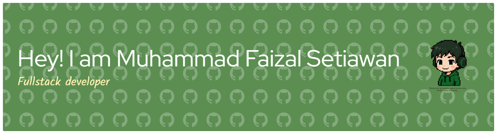

<!--
  README ini dibuat berdasarkan contoh visual yang Anda kirim.
  Username GitHub: FaizalSetiawan
  Nama tampil: Zall
  Sesuaikan tautan sosial (LinkedIn / Instagram / Facebook) bila perlu.
-->

<!-- Running text / Marquee -->
<!-- Header / Profile -->
# Hello there 👋 I'm Zall ✨

Halo! Saya Zall (Muhammad Faizal Setiawan) — Fullstack Developer yang suka membuat website dan belajar networking.
Saya senang bereksperimen dengan front-end, back-end, dan tooling DevOps kecil-kecilan.

---

## Connect With Me

  
  
  
  

  

 

---

## Tech

<!-- Badges for quick visuals -->

  

---
## Website & Tools
  

---
# 📊 GitHub Stats:
 
 

---

## About / What I do

* Membangun aplikasi web fullstack (React / Vue / Node / Laravel / Django)
* Menyukai clean UI, performance dan deployment otomatis
* Suka belajar hal baru: jaringan, security dasar, dan infra sederhana

---
<picture>
  <source media="(prefers-color-scheme: dark)" srcset="https://raw.githubusercontent.com/FaizalSetiawan/FaizalSetiawan/output/pacman-contribution-graph-dark.svg">
  <source media="(prefers-color-scheme: light)" srcset="https://raw.githubusercontent.com/FaizalSetiawan/FaizalSetiawan/output/pacman-contribution-graph.svg">
  
</picture>

---

Jika mau ngobrol atau kolaborasi, silakan hubungi saya lewat LinkedIn atau kirim issue / PR di repositori ini.
Terima kasih sudah mampir! ✨
